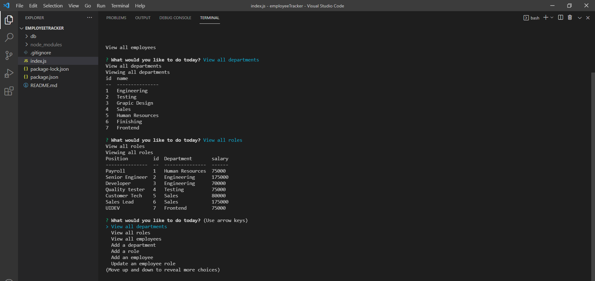
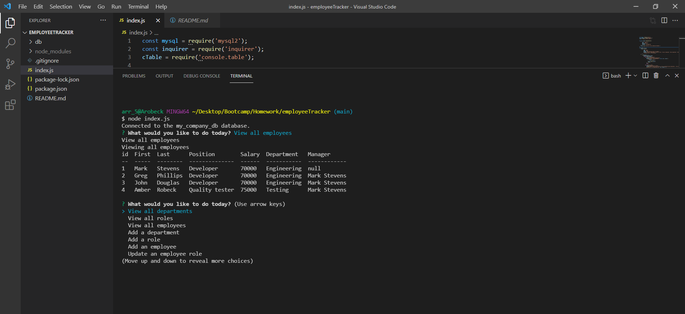

# Employee Tracker

 ## Description

    Welcome to my Employee tracker! This application was created with Node.js using the built in 
    package Inquirer (for collecting user input). This application also uses mySQL and mySQL2 package
    and is using console.table package to show tables in the command line! This
    application is ran from the back-end and does not have a deployed page however, 
    it can be ran on the command line!

  ---

  ## Table of Contents
  
  - [Usage](#usage)
  - [Installation](#installation)
  - [Walk-through video](#walk-through)
  - [Screenshots](#screenshots)
  - [License](#license)
  - [Contributions](#how-to-contribute)
  - [Questions](#questions)

  ## Usage
    Use this how you see fit to save information onto the database!

  ---

  ## Installation

    This project is ran through Node.js, clone the repo and install the required dependencies, run the schema.sql
    and seed.sql to prepopulate the database.

  ---

  ## Walk-through

    Here is a link to the walk through video to show functionality of the application

[link to whole video](https://drive.google.com/file/d/13-uDX1xneuYkZZLywHUfQl6WpbXGm2i_/view "Whole walkthrough video")

  ---

  ## Screenshots

    Here is a screen shot of tables created.

    

  ---

  ## License

   MIT License

Copyright (c) [2022] [Amber Robeck]

Permission is hereby granted, free of charge, to any person obtaining a copy
of this software and associated documentation files (the "Software"), to deal
in the Software without restriction, including without limitation the rights
to use, copy, modify, merge, publish, distribute, sublicense, and/or sell
copies of the Software, and to permit persons to whom the Software is
furnished to do so, subject to the following conditions:

The above copyright notice and this permission notice shall be included in all
copies or substantial portions of the Software.

THE SOFTWARE IS PROVIDED "AS IS", WITHOUT WARRANTY OF ANY KIND, EXPRESS OR
IMPLIED, INCLUDING BUT NOT LIMITED TO THE WARRANTIES OF MERCHANTABILITY,
FITNESS FOR A PARTICULAR PURPOSE AND NONINFRINGEMENT. IN NO EVENT SHALL THE
AUTHORS OR COPYRIGHT HOLDERS BE LIABLE FOR ANY CLAIM, DAMAGES OR OTHER
LIABILITY, WHETHER IN AN ACTION OF CONTRACT, TORT OR OTHERWISE, ARISING FROM,
OUT OF OR IN CONNECTION WITH THE SOFTWARE OR THE USE OR OTHER DEALINGS IN THE
SOFTWARE.

  
  ---
  
  ## How to Contribute

     However you would like, just email me!

  [Contributor Covenant](https://www.contributor-covenant.org/)

  ---

  ## Questions
  
  Contact me here:   arr5533@gmail.com
  
  [My gitHub profile](https://github.com/Amber-Robeck)
